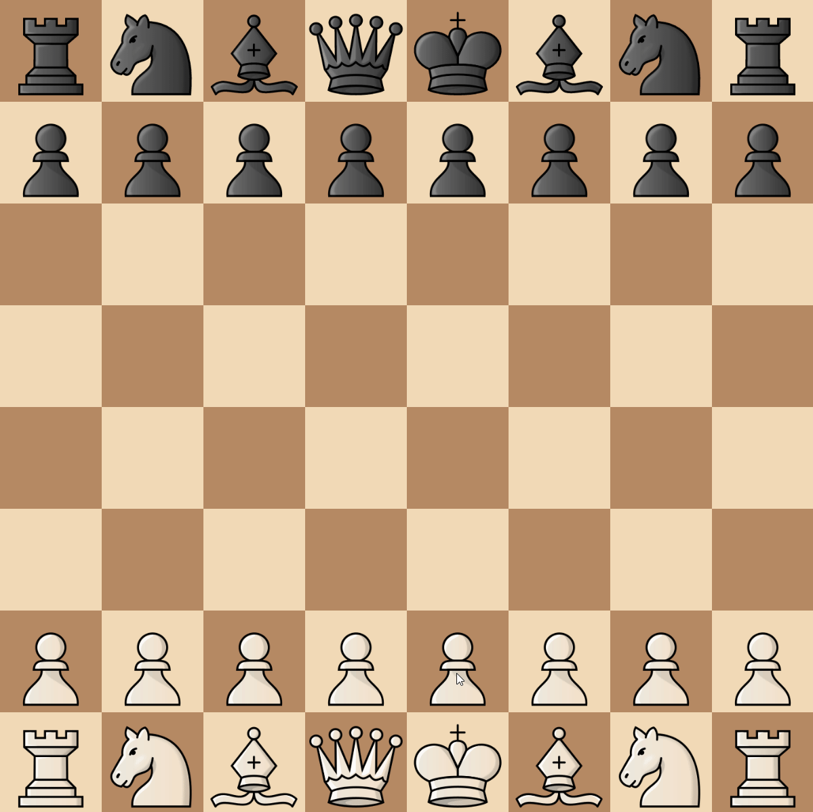

# Chess

A simple Chess game made in Java with [LWJGL](https://www.lwjgl.org/)/OpenGL.  
This can most likely be improved, but I did not put much time into it since it is just a side project.

### Features

-   Logic implemented for all pieces
-   Shows possible moves in the GUI _(filters based on check detection, so it only shows move which either get you out of check or don't put you in check)_
-   Checkmate detection
-   Check detection
-   And more...

### Preview

